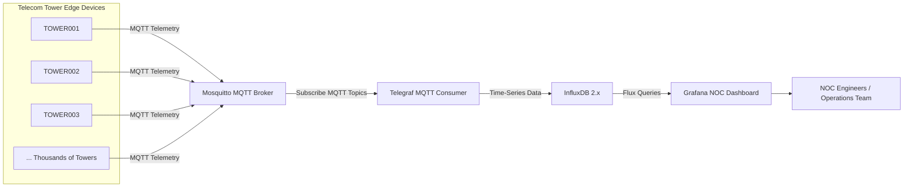
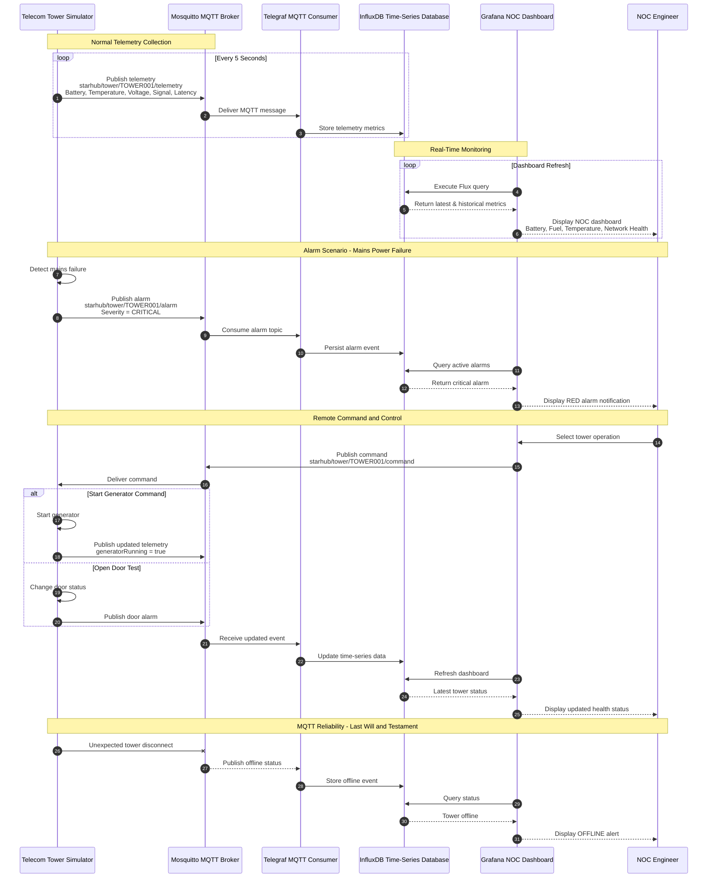
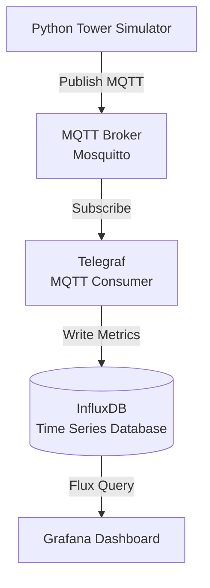
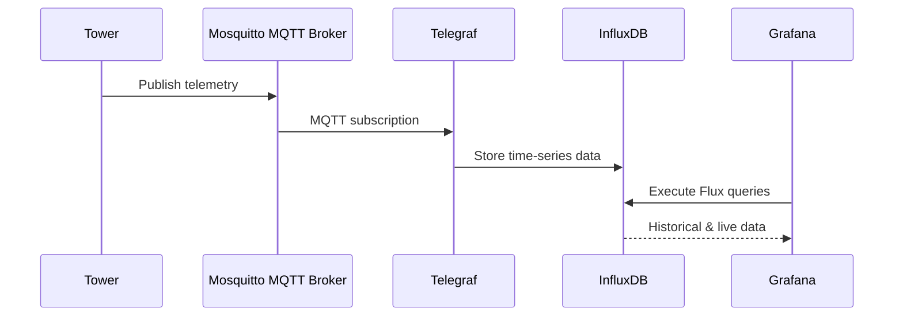
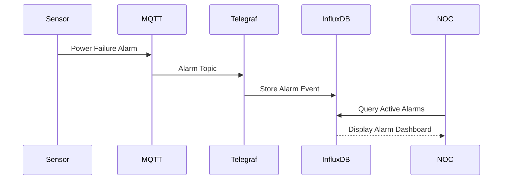

# MQTT-Based Telecom Tower Monitoring PoC

## High-Level Design Document (HLD)

---

# 1. Executive Summary

This Proof of Concept (PoC) demonstrates a scalable, real-time telecom tower monitoring platform using MQTT-based IoT communication.

The solution simulates multiple telecom towers publishing operational telemetry data to an MQTT broker. The data is processed and stored in a time-series database and visualized through Grafana dashboards similar to a telecom Network Operations Center (NOC).

The PoC demonstrates:

* Real-time tower health monitoring
* Power and battery management
* Generator and fuel monitoring
* Environmental monitoring
* Network performance monitoring
* Alarm detection and notification
* Historical data analysis
* Multi-tower scalability
* MQTT-based command and control

---

# 2. Business Use Case

## Telecom Tower Monitoring

A telecom operator manages thousands of distributed towers. Each tower contains multiple devices and sensors that must be continuously monitored.

### Monitored Parameters

| Category    | Parameters                                                               |
| ----------- | ------------------------------------------------------------------------ |
| Power       | Mains status, Voltage, Battery percentage, Battery voltage               |
| Generator   | Generator status, Fuel level, Runtime                                    |
| Environment | Temperature, Door status                                                 |
| Network     | Router status, Signal strength, Latency, Packet loss                     |
| Alarms      | Power failure, Low battery, Door open, High temperature, Network failure |

---

# 3. High-Level Architecture



---

# Sequnce daigram



# 4. Component Architecture



---

# 5. MQTT Topic Design

The solution follows a structured MQTT topic hierarchy.

```text
starhub/
   tower/
      TOWER001/
         telemetry
         alarm
         status
         command
```

---

## Example Topics

| Topic                            | Purpose               |
| -------------------------------- | --------------------- |
| starhub/tower/TOWER001/telemetry | Sensor telemetry      |
| starhub/tower/TOWER001/alarm     | Critical alarms       |
| starhub/tower/TOWER001/status    | Online/offline status |
| starhub/tower/TOWER001/command   | Remote commands       |

---

# 6. MQTT Message Flow



---

# 7. Alarm Flow



---

# 8. Data Model Example

## Telemetry JSON

```json
{
  "towerId": "TOWER001",
  "mainsAvailable": 1,
  "voltage": 230.5,
  "batteryPercent": 95,
  "batteryVoltage": 52.3,
  "generatorRunning": 0,
  "fuelPercent": 80,
  "temperatureC": 30.2,
  "doorOpen": 0,
  "networkStatus": 1,
  "signalDbm": -65,
  "latencyMs": 22,
  "packetLossPercent": 0.1
}
```

---

# 9. Grafana NOC Dashboard

The dashboard provides a real-time operational view.

## Executive Overview

* Total towers monitored
* Online vs offline towers
* Active critical alarms
* Overall network health

## Tower Detail Dashboard

* Battery gauge
* Fuel gauge
* Temperature trend
* Voltage monitoring
* Signal strength
* Latency trend
* Door status
* Generator status

## Alarm Dashboard

Displays:

* Timestamp
* Tower ID
* Alarm severity
* Alarm description
* Current status

---

# 10. Security Architecture

The PoC supports enterprise-grade MQTT security.

| Layer         | Capability                       |
| ------------- | -------------------------------- |
| Network       | TLS encryption                   |
| MQTT          | Username/password authentication |
| Authorization | Topic-based access control       |
| Monitoring    | Connection and message tracking  |
| Reliability   | MQTT QoS levels                  |

---

# 11. MQTT Features Demonstrated

| Feature                 | Demonstration                  |
| ----------------------- | ------------------------------ |
| Publish                 | Tower telemetry publishing     |
| Subscribe               | Telegraf real-time consumption |
| Wildcards               | Monitoring multiple towers     |
| QoS                     | Reliable message delivery      |
| Retained Messages       | Latest tower status            |
| Last Will and Testament | Tower offline detection        |
| Commands                | Remote tower operations        |
| Scalability             | Thousands of simulated towers  |

---

# 12. Demo Scenario

## Normal Operations

```
TOWER001
Status: ONLINE
Power Source: MAINS
Battery: 95%
Temperature: 30°C
Network: HEALTHY
```

---

## Power Failure Scenario

```
Mains Power = FAILED
Generator = STARTED
Fuel Consumption = ACTIVE
Alarm = CRITICAL
```

---

## Door Intrusion Scenario

```
Door Status = OPEN
Alarm Severity = MAJOR
NOC Dashboard Alert Generated
```

---

## Network Failure Scenario

```
Router = OFFLINE
Signal = UNKNOWN
Latency = HIGH
Alarm Generated
```

---

# 13. Technology Stack

| Component              | Technology             |
| ---------------------- | ---------------------- |
| Device Simulation      | Python                 |
| Messaging              | Eclipse Mosquitto MQTT |
| Data Collection        | Telegraf               |
| Time-Series Storage    | InfluxDB 2.x           |
| Visualization          | Grafana                |
| Communication Protocol | MQTT                   |

---

# 14. Future Enhancements

The architecture can be extended with:

* AI/ML predictive maintenance
* Automated alarm correlation
* SMS/Email notifications
* Integration with OSS/BSS systems
* Digital twin visualization
* Edge analytics
* Kubernetes-based scaling

---

# 15. Conclusion

This PoC demonstrates how MQTT can be used to build a scalable, secure, and real-time telecom monitoring platform capable of managing thousands of distributed towers.

The architecture follows modern IoT design principles and provides a foundation for a production-grade telecom NOC monitoring solution.

---
